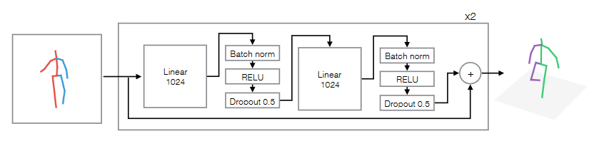

# 3d-pose-baseline
Tensorflow implementation of the paper A Simple Yet Effective Baseline for 3D Human Pose Estimation.

The authors' own implementation can be found [here](https://github.com/una-dinosauria/3d-pose-baseline).

</img>

## Setup

1. Create a new directory title ``data`` at the root of the repository.
2. Download the [Human3.6M dataset](http://www.cs.stanford.edu/people/ashesh/h3.6m.zip) and extract it into the ``data`` directory.

## Docker Environment

Building image:
```
docker-compose build
```

Starting container/environment:
```
docker-compose up -d
```

Opening a shell in container:
```
docker-compose exec 3d-pose-baseline bash
```

Instead of opening a shell, you can also go to http://localhost:8888/ to access a Jupyter Lab instance running inside the container.

Stopping container/environment:
```
docker-compose down
```

## Citations

```bibtex
@inproceedings{martinez_2017_3dbaseline,
    title={A simple yet effective baseline for 3d human pose estimation},
    author={Martinez, Julieta and Hossain, Rayat and Romero, Javier and Little, James J.},
    booktitle={ICCV},
    year={2017}
}
```

```bibtex
@article{h36m_pami,
    title = {Human3.6M: Large Scale Datasets and Predictive Methods for 3D Human Sensing in Natural Environments},
    author = {Ionescu, Catalin and Papava, Dragos and Olaru, Vlad and Sminchisescu, Cristian},
    journal = {IEEE Transactions on Pattern Analysis and Machine Intelligence},
    publisher = {IEEE Computer Society},
    year = {2014}
}
```

```bibtex
@inproceedings{IonescuSminchisescu11,
    title = {Latent Structured Models for Human Pose Estimation},
    author = {Catalin Ionescu, Fuxin Li, Cristian Sminchisescu},
    booktitle = {International Conference on Computer Vision},
    year = {2011}
}
```
